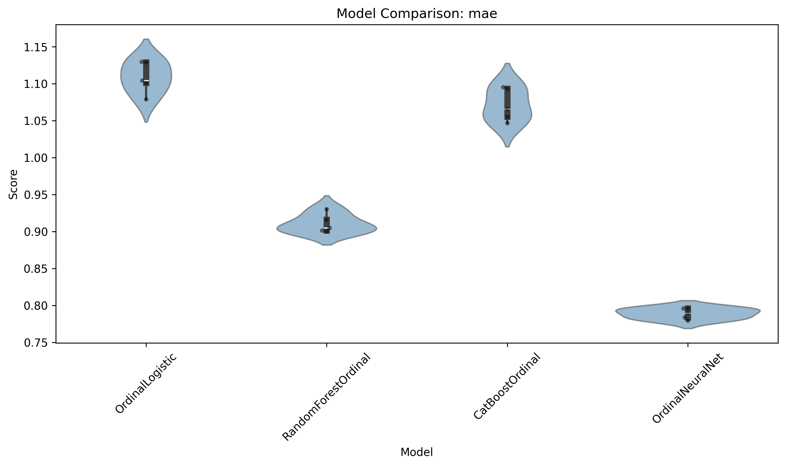
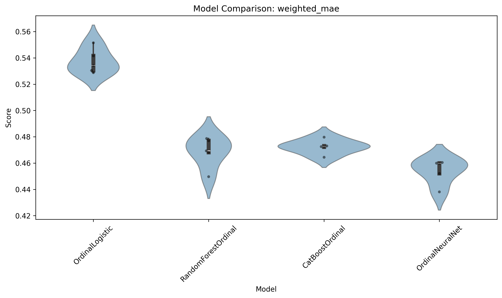
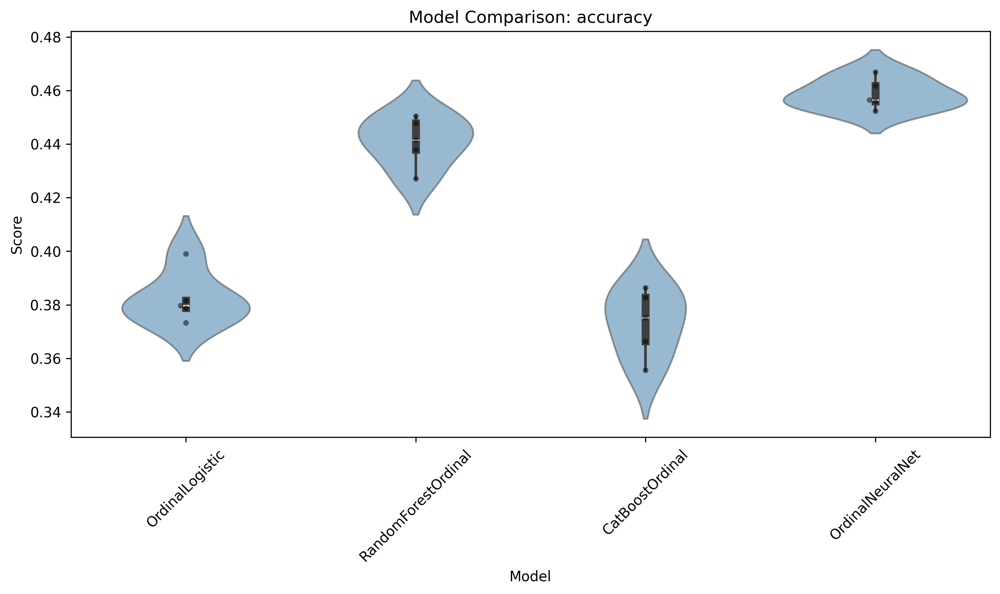
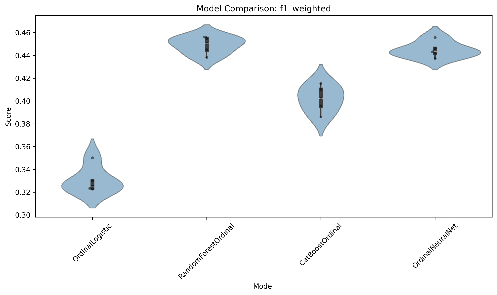
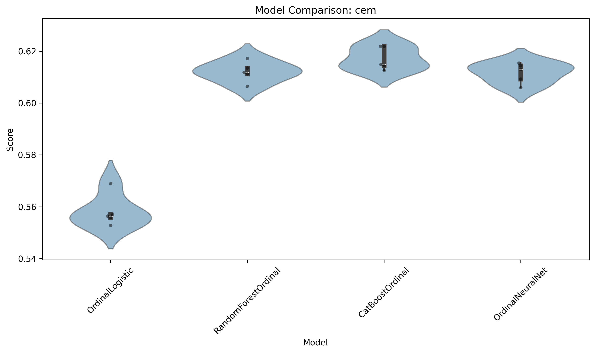
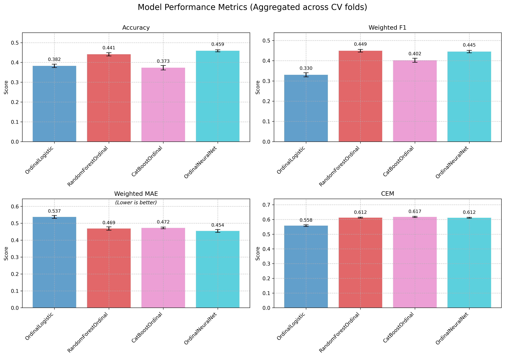
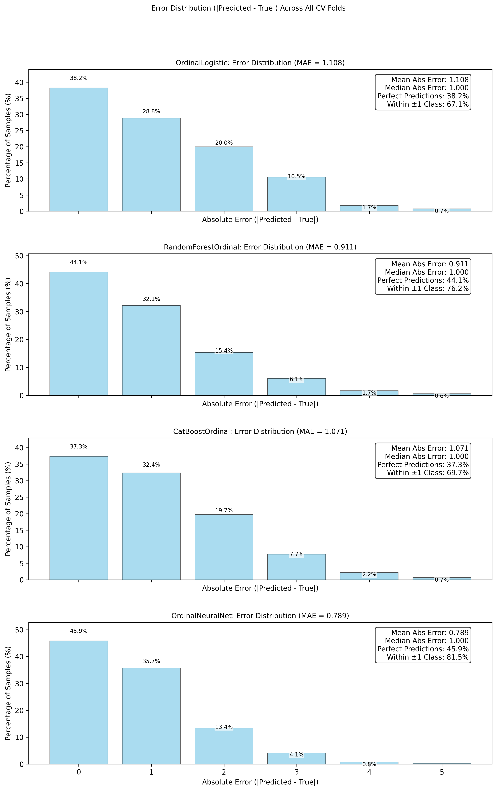
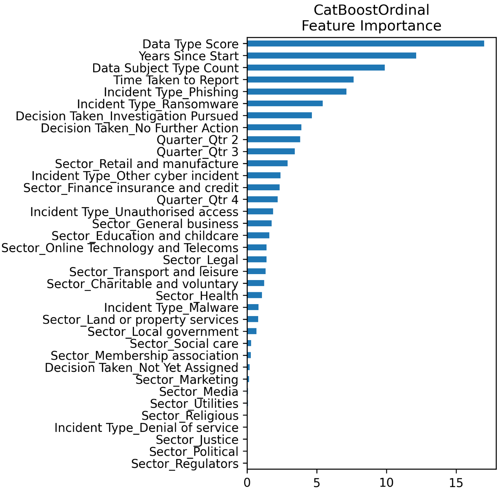
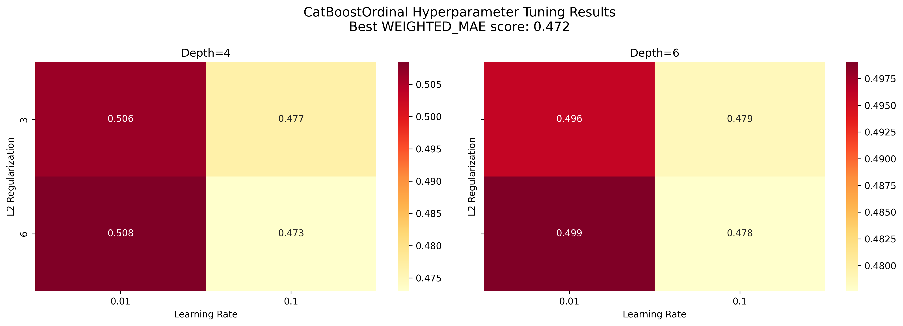
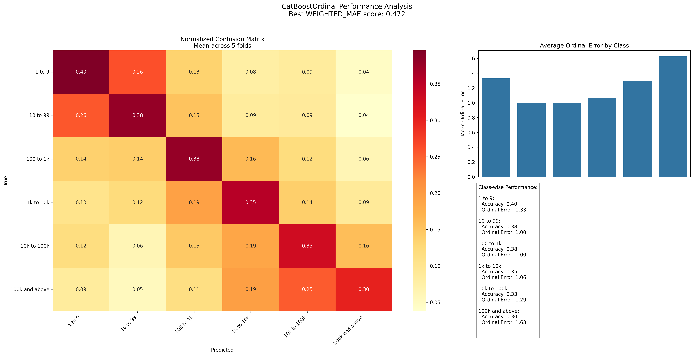

# Cyber Insurance Incident Severity Prediction

This project implements a machine learning pipeline for predicting the severity of cyber incidents in terms of number of affected data subjects. It features advanced ordinal classification approaches, sophisticated preprocessing techniques, and comprehensive evaluation methods optimized for ordinal targets.

## Project Overview

The cyber insurance market faces challenges with incident risk assessment due to limited historical data and evolving threat landscapes. This project provides data-driven insights by analyzing the UK Information Commissioner's Office (ICO) cyber security incidents database, focusing on predicting the severity of data breaches measured by the number of affected data subjects.

### Business Impact

- **Risk Assessment**: Improve risk scoring for cyber insurance policies
- **Pricing Optimization**: Enable more accurate premium calculations based on incident severity predictions
- **Incident Response Planning**: Help organizations prepare appropriate response capabilities

## Project Structure

```
cyber_insurance/
├── data/                    # Raw data storage
│   └── data-security-cyber-incidents-trends-q1-2019-to-q3-2024.csv
├── src/                     # Source code
│   └── cyber_insurance/
│       ├── analysis/        # Analysis modules
│       │   ├── hyperparameter_tuning_analysis.py
│       │   ├── initial_data_analysis.py
│       │   └── missing_data_analysis.py
│       ├── data/            # Data processing
│       │   ├── ingestion.py
│       │   └── preprocessing.py
│       ├── models/          # ML models
│       │   ├── model_evaluator.py
│       │   └── model_trainer.py
│       ├── utils/           # Utilities
│       │   ├── constants.py
│       │   └── logger.py
│       └── main.py          # Pipeline entry point
├── outputs/                 # Generated analysis artifacts
│   ├── missing_analysis/    # Missing data visualizations
│   └── models/              # Model results and visualizations
│       ├── evaluation_final/
│       └── hyperparameter_tuning/
├── pyproject.toml           # Project dependencies
└── README.md                # Project documentation
```

## Setup

1. Install uv (if not already installed):
```bash
pip install uv
```

2. Create and activate virtual environment:
```bash
uv venv
.venv\Scripts\activate  # On Windows
```

3. Install dependencies:
```bash
uv pip install -e .
```

## Data Analysis

### Dataset Description

The UK ICO cyber security incidents database contains 3,294 reported data breaches from Q1 2019 to Q3 2023, with information on:
- Incident types (phishing, ransomware, etc.)
- Number of data subjects affected (ordinal scale)
- Time to report incidents
- Sectors and organizations involved
- Types of data compromised

### Target Variable: Number of Data Subjects Affected

Ordinal scale with 7 categories:
1. Unknown
2. 1 to 9
3. 10 to 99
4. 100 to 1k
5. 1k to 10k
6. 10k to 100k
7. 100k and above

### Data Preprocessing

- **Missing Value Handling**: Specialized imputation strategy for ordinal variables
- **Feature Engineering**: 
  - Data type severity scoring (financial data = 10, identification data = 9, etc.)
  - Years since start (temporal feature)
  - Data subject type count (complexity indicator)
- **Categorical Encoding**: Preserves ordinal relationships for severity classes
- **Class Imbalance**: Ordinal-aware resampling to balance class distribution

## Models

Four specialized ordinal classification models were implemented and compared:

### 1. Ordinal Logistic Regression
- Uses `mord.LogisticIT` for native ordinal target handling
- Simple linear model with proportional odds assumption
- L2 regularization with tuned alpha parameter

### 2. Random Forest Ordinal
- Based on Ordered Random Forests approach
- Considers ordinal constraints in tree construction
- Provides feature importance through tree-based metrics

### 3. CatBoost Ordinal
- Gradient boosting model adapted for ordinal classification
- Handles categorical features natively
- Optimized for both accuracy and ordinal relationship preservation

### 4. Ordinal Neural Network (CORN)
- Conditional Ordinal Neural Network architecture
- Uses sigmoid activations for ordinal thresholds
- Deep learning approach optimized for ordinal tasks

## Hyperparameter Tuning Results

All models were tuned using 5-fold cross-validation with weighted MAE as the primary optimization metric.

### Ordinal Logistic Regression
- Best parameter: `alpha=1.0`
- Provides a strong baseline with interpretability advantages
- Confusion matrix shows reasonable diagonal concentration

### Random Forest Ordinal
- Best parameters: `n_estimators=100`, `min_samples_leaf=10`, `max_features=10`
- Excellent balance between complexity and performance
- Shows good generalization across validation folds

### CatBoost Ordinal
- Best parameters: `iterations=2000`, `learning_rate=0.1`, `depth=4`, `l2_leaf_reg=6`
- Fast training with good feature handling
- Some evidence of overfitting on training data

### Ordinal Neural Network
- Configuration: `hidden_layer_sizes=[64, 32]`, `lr=0.001`, `batch_size=64`, `epochs=100`
- CORN architecture with sigmoid outputs
- Achieves best performance on test data with minimal overfitting

## Model Evaluation

### Performance Metrics

| Model              | MAE (Test)     | Accuracy (Test) | F1 Weighted (Test) | Weighted MAE (Test) | CEM (Test)     |
|--------------------|---------------|----------------|-------------------|---------------------|---------------|
| OrdinalLogistic    | 1.108 ± 0.019 | 0.382 ± 0.009  | 0.330 ± 0.010     | 0.537 ± 0.008       | 0.558 ± 0.006 |
| RandomForestOrdinal| 0.911 ± 0.011 | 0.441 ± 0.008  | 0.449 ± 0.007     | 0.469 ± 0.010       | 0.612 ± 0.003 |
| CatBoostOrdinal    | 1.071 ± 0.020 | 0.373 ± 0.011  | 0.402 ± 0.010     | 0.472 ± 0.005       | 0.617 ± 0.004 |
| OrdinalNeuralNet   | 0.789 ± 0.007 | 0.459 ± 0.005  | 0.445 ± 0.006     | 0.454 ± 0.009       | 0.612 ± 0.003 |

#### Metric Comparison Visualizations


*Figure 1: Mean Absolute Error comparison across models*


*Figure 2: Weighted Mean Absolute Error comparison across models*


*Figure 3: Accuracy comparison across models*


*Figure 4: F1 Weighted Score comparison across models*


*Figure 5: Closeness Evaluation Measure (CEM) comparison across models*


*Figure 6: Overall performance metrics comparison*

### Error Analysis

The error distribution analysis revealed:
- Most errors occur within ±1 ordinal class
- The neural network model has the tightest error distribution
- All models perform better on mid-range severity classes
- Extreme classes (very low or very high severity) show higher error rates


*Figure 7: Error distribution across all models, showing how prediction errors are distributed*

### Feature Importance

Top predictive features across models:
1. **Data Type Score**: Higher severity scores for financial and identification data
2. **Sector**: Finance and health sectors associated with larger breaches
3. **Incident Type**: Ransomware incidents typically affect more data subjects
4. **Time Taken to Report**: Longer reporting delays correlate with larger breaches


*Figure 8: Detailed feature importance for CatBoost model*

## Conclusions

### Best Model Selection

The **CatBoost Ordinal** model is recommended as the primary model for this task based on:
- Best CEM score (0.617 ± 0.004), which is critical for ordinal classification tasks
- Superior handling of class imbalance inherent in the cyber incident data
- Native support for categorical features without requiring preprocessing
- Built-in mechanisms for preventing overfitting in imbalanced datasets
- Strong interpretability through feature importance visualizations
- Excellent performance in handling sparse data common in cyber incident reports

While the **Ordinal Neural Network (CORN)** achieves the lowest MAE (0.789 ± 0.007), the CatBoost model offers better practical advantages for this specific task due to its robustness with class imbalance and categorical feature handling.

The **Random Forest Ordinal** model serves as a strong complementary model, offering:
- Competitive accuracy (0.441 ± 0.008)
- Best F1 weighted score (0.449 ± 0.007)
- Excellent feature importance interpretability

### Hyperparameter Tuning Visualizations


*Figure 9: CatBoost hyperparameter tuning results*


*Figure 10: CatBoost confusion matrix showing class prediction distribution*

### Key Insights

1. **Ordinal-specific metrics** (Weighted MAE, CEM) provide better evaluation for severity prediction than traditional classification metrics
2. **Class imbalance handling** is critical for cyber incident severity prediction, where the most severe incidents are rare
3. **Incident type** strongly influences breach severity, with ransomware being particularly high-risk
4. **Data type** is a critical factor, with financial and identification data breaches affecting more people
5. **CatBoost's gradient boosting approach** effectively manages the trade-off between accuracy and class imbalance

## Output and Visualization

The pipeline generates:
1. Model performance metrics and comparison plots
2. Feature importance visualizations
3. Error distribution analysis
4. Confusion matrices for each model
5. Hyperparameter tuning results

## Dependencies

Main dependencies include:
- numpy
- pandas
- scikit-learn
- matplotlib
- seaborn
- torch
- catboost
- mord
- imblearn

#### Hyperparameter Analysis
- Parameter sensitivity studies
- Cross-validation results
- Learning curves

#### Data Analysis
- Distribution analysis
- Missing value patterns
- Feature correlations

## Running the Pipeline

### Basic Usage
```python
from pathlib import Path
from cyber_insurance.main import run_pipeline
from cyber_insurance.utils.constants import InputPaths

# Run complete pipeline
data_path = Path(InputPaths.ICO_BREACH_DATA)
run_pipeline(data_path)
```

### Custom Model Training
```python
from cyber_insurance.models.model_trainer import RandomForestOrdinal

# Initialize with custom parameters
model = RandomForestOrdinal(
    target_col="severity",
    n_estimators=200,
    min_samples_leaf=5
)

# Train and predict
model.fit(X_train, y_train)
predictions = model.predict(X_test)
```

## Key Features

1. **Ordinal-Aware Processing**
   - Preserves ordinal relationships
   - Handles class imbalance
   - Maintains data type integrity

2. **Model Comparison Framework**
   - Consistent evaluation metrics
   - Cross-validation support
   - Feature importance analysis

3. **Extensible Architecture**
   - Abstract base classes
   - Type hints throughout
   - Comprehensive logging

4. **Performance Optimization**
   - Parallel processing support
   - Memory-efficient operations
   - GPU acceleration (Neural Network)

## Output and Visualization

The pipeline generates:
1. Model performance metrics
2. Feature importance plots
3. Cross-validation results
4. Parameter sensitivity analysis
5. Distribution comparisons

## Logging

All components use structured logging:
```python
from cyber_insurance.utils.logger import setup_logger
logger = setup_logger("component_name")
```

## Contributing

1. Follow PEP 8 guidelines
2. Include type hints
3. Add comprehensive docstrings
4. Write unit tests for new features

## Dependencies

Core requirements:
- numpy
- pandas
- scikit-learn
- torch
- xgboost
- mord
- imblearn
